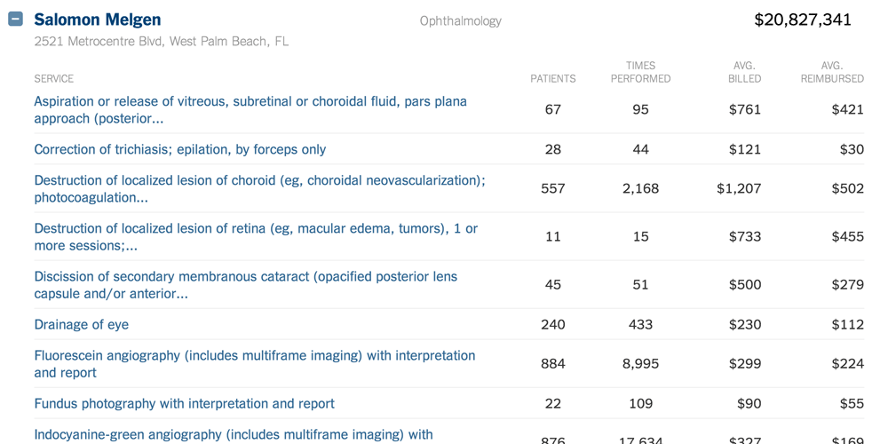

## CMS Medicare Provider fees; A data diary

Steps to bootstrap a MySQL database from the [April 9, 2014 Medicare fee data dump](http://www.cms.gov/Research-Statistics-Data-and-Systems/Statistics-Trends-and-Reports/Medicare-Provider-Charge-Data/Physician-and-Other-Supplier.html).


## Quick steps

The original 1.7 GB tab delimited text file has been divided into two tables, `providers` and `payments`:


1. Create a new MySQL database
2. Run [providers-table.sql](sql/payments-table.sql) 
3. Run [payments-table.sql](sql/payments-table.sql)
4. Download [providers.csv.gz file](http://danwin-files.s3.amazonaws.com/data/cms/2014-04/providers.csv.gz) and import into `providers` table (39.8 MB zipped / 155 MB uncompressed)
5. Download [payments.csv.gz file](http://danwin-files.s3.amazonaws.com/data/cms/2014-04/payments.csv.gz) and import into `payments` table (247.2 MB zipped / 914.3 MB uncompressed)
6. Run [providers-indices.sql](sql/providers-indices.sql) to create (supposedly) unique index across NPI, place of service, and yes/no to Medicare participation, as well as index for U.S. state, and an index for U.S. zip code
7. Run [payments-indices.sql](sql/payments-indices.sql) with same grouped index as above as well as index by `hcpcs_code`


Note: the field sizes aren't as small as they could be. I was too lazy to manually adjust them. You can find the official spec [in Appendix A of the CMS methodology document](http://www.cms.gov/Research-Statistics-Data-and-Systems/Statistics-Trends-and-Reports/Medicare-Provider-Charge-Data/Downloads/Medicare-Physician-and-Other-Supplier-PUF-Methodology.pdf).


## Sample queries


#### Spot checking against the New York Times

[NYT Interactive Database](http://www.nytimes.com/interactive/2014/04/09/health/medicare-doctor-database.html) search for Dr. Salomon Melgen of Florida ([interviewed here](http://www.nytimes.com/2014/04/10/business/doctor-with-big-medicare-billings-is-no-stranger-to-scrutiny.html?hp))




```sql
SELECT  providers.npi, providers.medicare_participation_indicator, providers.place_of_service,
  nppes_provider_last_org_name, nppes_provider_first_name, nppes_provider_mi, 
  nppes_credentials, nppes_entity_code, 
  nppes_provider_city, nppes_provider_state, nppes_provider_zip, nppes_provider_country,
  provider_type,
  hcpcs_code,
  line_srvc_cnt, 
  bene_unique_cnt,
  bene_day_srvc_cnt,
  average_Medicare_allowed_amt,
  average_submitted_chrg_amt,
  average_Medicare_payment_amt,
  SUM(average_Medicare_allowed_amt * line_srvc_cnt) AS total_Medicare_allowed_amt, 
  SUM(average_submitted_chrg_amt * line_srvc_cnt) AS total_submitted_chrg_amt, 
  SUM(average_Medicare_payment_amt * line_srvc_cnt) AS total_Medicare_payment_amt

FROM payments

INNER JOIN providers
    USING(npi, medicare_participation_indicator, place_of_service)

WHERE 
  providers.`npi` = "1245298371"
GROUP BY 
  providers.npi, providers.medicare_participation_indicator, providers.place_of_service, hcpcs_code

ORDER BY nppes_provider_last_org_name, nppes_provider_first_name, nppes_provider_mi, npi,
  total_Medicare_payment_amt DESC
```


## Official data source and format

Name: "Medicare Provider Utilization and Payment Data: Physician and Other Supplier"


Homepage: [http://cms.gov/Research-Statistics-Data...](http://www.cms.gov/Research-Statistics-Data-and-Systems/Statistics-Trends-and-Reports/Medicare-Provider-Charge-Data/Physician-and-Other-Supplier.html)

- Tab delimited file format
- Lines terminated by `\r\n`
- Second line contains metadata (WTF)
- Quotation marks not used/needed to enclose values 


### Data features and counts

TK: more notes to come, including derivation of `payments` and `providers` tables from original file

- 9,153,273 rows (including useless second row) 
- 880,645 distinct NPI
 
  ``` sql
      SELECT COUNT(DISTINCT npi) FROM payments
  ```

- 1,117,074 distinct nppes info
 
  ``` sql
      select  npi,  nppes_provider_last_org_name,  nppes_provider_first_name,  nppes_provider_mi,  nppes_credentials,  nppes_provider_gender,  nppes_entity_code,  nppes_provider_street1,  nppes_provider_street2,  nppes_provider_city,  nppes_provider_zip,  nppes_provider_state,  nppes_provider_country,  provider_type,  medicare_participation_indicator,  place_of_service
FROM `payments`
GROUP BY npi,  nppes_provider_last_org_name,  nppes_provider_first_name,  nppes_provider_mi,  nppes_credentials,  nppes_provider_gender,  nppes_entity_code,  nppes_provider_street1,  nppes_provider_street2,  nppes_provider_city,  nppes_provider_zip,  nppes_provider_state,  nppes_provider_country,  provider_type,  medicare_participation_indicator,  place_of_service
  
  ```

- 1,117,074 distinct `npi` with `place_of_service` and `medicare_participation_indicator`
  
   ``` sql
       select COUNT(DISTINCT npi, medicare_participation_indicator, place_of_service)
   ```
